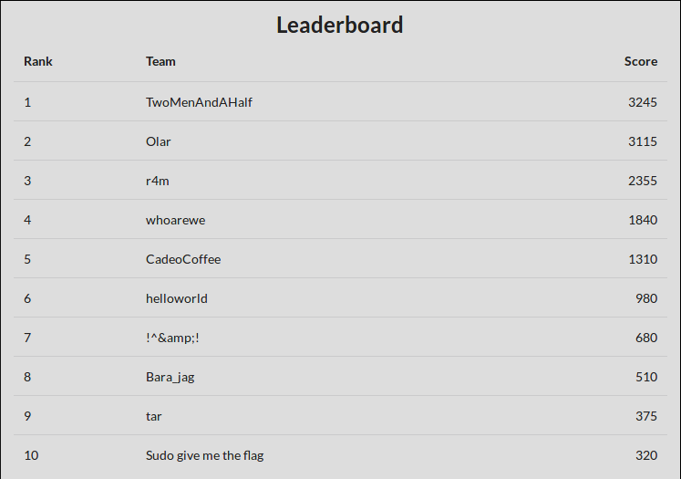

# IMECTF 0x7E1
- Período: de 05/05/2017 às 19:00h a 12/05/2017 às 00:00h
- Duração: 6 dias e 5 horas
- imesec.org

## Scoreboard

## FLAG LIST 

- Binary Exploitation
    + [ ] Auth System
    + [ ] Malicious Calculator
    + [ ] Guess the Number
    + [ ] Paradox Game
- Criptography
    + [X] NOPATTERN
    + [X] SN4P C4T
    + [X] Realidade Aumentada
    + [ ] 19
    + [ ] RSA
    + [ ] SUBSTITUTION
    + [ ] Random
    + [ ] Xing-Ling
    + [ ] So Visual
    + [ ] Incomplete
    + [ ] Broadcast
    + [ ] SHAke SHAck
    + [ ] Small_boxes
- Forensics
    + [ ] Are you HEADy?
    + [X] BEHIND_THE_EYES
    + [X] Uma imagem vale mais que mil palavras
    + [ ] A Hell of a Capture
    + [X] Rastros do Hackudão da Chatuba
    + [X] Wireless do Hackudão da Chatuba
- Miscellaneous
    + [ ] No SSH4You
    + [ ] NET is for CATs
    + [X] STUBBORNKEY
    + [ ] NOXPINACH
    + [ ] Tokens
    + [ ] aaloo
- Reverse Engineering
    + [ ] Code JSut Hard
    + [ ] ANCIENTMAGIC
    + [ ] Sistema de Tiro
    + [ ] Easy Guess
    + [ ] The Seed is Power
- Web Exploitation
    + [ ] A união faz a força
    + [ ] O hacker quer biscoito
    + [ ] I LIKE it
    + [ ] WeBeasy
